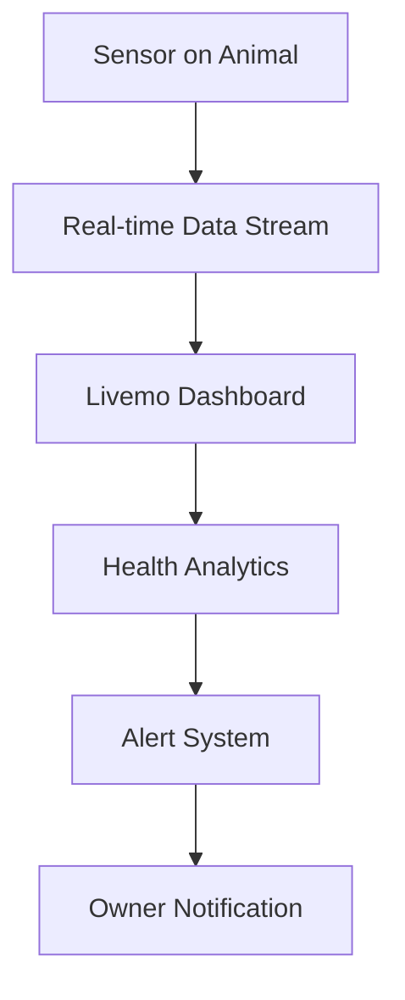

# Livemo Platform - Comprehensive Functionalities Guide

**Platform Name:** Livemo  
**Full Name:** Livestock Monitor  
**Target Users:** Pasture Owners, Livestock Farmers, Ranch Managers  
**Technology:** IoT Sensors + System Integration (SI) + Real-time Analytics

---

## 🎯 Platform Vision

Livemo is a comprehensive livestock management platform that empowers pasture owners to monitor, manage, and optimize their livestock operations through cutting-edge sensor technology and intelligent system integration.

---

## 🐄 Supported Livestock Types

### 1) **Poultry** 🐔
- **Chicken** - Layers & Broilers
- **Ducks** - Egg & Meat Production
- **Turkeys** - Commercial Turkey Farming

### 2) **Cattle** 🐄
- **Cows** - Dairy & Beef Cattle

### 3) **Small Ruminants** 🐐
- **Goats** - Dairy & Meat Goats
- **Sheep** - Wool & Meat

### 4) **Swine** 🐷
- **Pigs** - Commercial Swine

### 5) **Equine** �
- **Horses** - Work & Recreation

### 6) **Small Animals** 🐰
- **Rabbits** - Commercial Breeding

---

## 📱 Core Platform Functionalities

### 1. **Real-Time Health Monitoring** 🏥

#### **What It Does**
- Continuous health tracking via wearable IoT sensors
- Vital signs monitoring (temperature, heart rate, respiration)
- Activity level tracking and behavior analysis
- Early disease detection and alert system

#### **How Owners Use It**

#### **Benefits for Owners**
- **Early Disease Detection**: Identify sick animals 24-48 hours before visible symptoms
- **Reduced Mortality**: Quick intervention saves lives
- **Lower Veterinary Costs**: Prevent expensive treatments through early detection
- **Improved Productivity**: Healthy animals produce better (milk, eggs, meat)
- **Peace of Mind**: 24/7 monitoring without physical presence

---

### 2. **Location & Pasture Management** 🗺️

#### **What It Does**
- GPS tracking of each animal
- Virtual fence boundaries and geofencing
- Pasture utilization analysis
- Movement pattern monitoring

#### **How Owners Use It**
- Set virtual boundaries for grazing areas
- Monitor pasture usage and rotation
- Track animal movements in real-time
- Receive alerts for boundary breaches

#### **Benefits for Owners**
- **Prevent Loss**: Immediate alerts if animals leave designated areas
- **Optimize Grazing**: Better pasture management prevents overgrazing
- **Reduce Labor**: No need for physical fence checking
- **Improve Security**: Track stolen or lost animals quickly
- **Better Planning**: Data-driven pasture rotation decisions

---

### 3. **Feed Management & Nutrition** 🌾

#### **What It Does**
- Automated feeding schedule management
- Feed consumption tracking per animal
- Nutritional requirement calculations
- Feed inventory and cost optimization

#### **How Owners Use It**
- Input animal types, weights, and production goals
- Receive automated feeding schedules
- Monitor feed consumption patterns
- Get cost optimization recommendations

#### **Benefits for Owners**
- **Reduce Feed Waste**: Optimize feeding amounts and schedules
- **Lower Costs**: 15-25% reduction in feed expenses
- **Improve Growth**: Better nutrition leads to faster growth
- **Save Time**: Automated scheduling reduces manual work
- **Better ROI**: Optimal feed-to-production ratios

---

### 4. **Breeding & Reproduction Management** 💕

#### **What It Does**
- Heat detection and breeding cycle tracking
- Pregnancy monitoring via sensors
- Genetic record keeping
- Breeding schedule optimization

#### **How Owners Use It**
- Monitor heat cycles automatically
- Track pregnancy progress
- Manage breeding schedules
- Maintain genetic records

#### **Benefits for Owners**
- **Increase Birth Rates**: Better breeding timing
- **Reduce Miscarriages**: Early pregnancy complications detection
- **Improve Genetics**: Better breeding decisions
- **Plan Production**: Predictable birthing schedules
- **Enhanced Record Keeping**: Complete reproductive history

---

### 5. **Weight & Growth Tracking** ⚖️

#### **What It Does**
- Automated weight measurements via smart scales
- Growth curve analysis
- Performance benchmarking
- Market readiness predictions

#### **How Owners Use It**
- Set target weights for different life stages
- Monitor growth progress
- Compare performance against benchmarks
- Plan optimal selling times

#### **Benefits for Owners**
- **Optimal Selling**: Sell at peak weight for best prices
- **Performance Tracking**: Identify underperforming animals
- **Better Planning**: Predict market readiness
- **Quality Control**: Consistent product quality
- **Increased Profits**: Optimize weight-to-feed ratios

---

### 6. **Vaccination & Medical Records** 💉

#### **What It Does**
- Automated vaccination schedules
- Medical treatment tracking
- Compliance reporting
- Supply management

#### **How Owners Use It**
- Set vaccination schedules based on local requirements
- Track treatments and medications
- Generate compliance reports
- Manage medical supplies

#### **Benefits for Owners**
- **Never Miss Vaccinations**: Automated reminders
- **Regulatory Compliance**: Easy report generation
- **Better Health Management**: Complete medical history
- **Reduce Penalties**: Avoid compliance issues
- **Professional Management**: Industry-standard record keeping

---

### 7. **Environmental Monitoring** 🌡️

#### **What It Does**
- Weather condition monitoring
- Pasture quality assessment
- Air and water quality tracking
- Climate impact analysis

#### **How Owners Use It**
- Monitor weather conditions in real-time
- Assess pasture quality
- Track environmental factors affecting livestock
- Receive weather alerts

#### **Benefits for Owners**
- **Weather Protection**: Move animals before bad weather
- **Better Pasture Management**: Optimal grazing conditions
- **Disease Prevention**: Climate-related disease risk reduction
- **Resource Planning**: Better water and feed planning
- **Risk Management**: Climate-related risk mitigation

---

### 8. **Alert & Notification System** 🚨

#### **What It Does**
- Multi-channel alert system (SMS, Email, App Push)
- Customizable alert thresholds
- Escalation protocols
- Historical alert tracking

#### **How Owners Use It**
- Set custom alert thresholds for each metric
- Choose preferred notification channels
- Set escalation procedures
- Review alert history and patterns

#### **Benefits for Owners**
- **Immediate Response**: Quick action on critical issues
- **Customizable Control**: Set alerts based on specific needs
- **Peace of Mind**: Know you'll be notified of issues
- **Better Decision Making**: Data-driven alert responses
- **Risk Reduction**: Proactive problem solving

---

### 9. **Analytics & Business Intelligence** 📊

#### **What It Does**
- Performance analytics and reporting
- Profitability analysis
- Trend identification
- Predictive analytics

#### **How Owners Use It**
- View comprehensive dashboards
- Generate performance reports
- Analyze trends and patterns
- Make data-driven decisions

#### **Benefits for Owners**
- **Better Decisions**: Data-driven business choices
- **Increased Profitability**: Identify optimization opportunities
- **Competitive Advantage**: Advanced analytics capabilities
- **Planning**: Better long-term planning
- **Investment Optimization**: Know where to invest resources

---

### 10. **Mobile App for Field Operations** 📱

#### **What It Does**
- Mobile access to all platform features
- Offline capabilities for remote areas
- Field data entry and scanning
- Push notifications

#### **How Owners Use It**
- Monitor animals from anywhere
- Enter data while in the field
- Receive alerts on mobile devices
- Work offline in remote pastures

#### **Benefits for Owners**
- **Mobility**: Manage from anywhere
- **Field Efficiency**: Work directly with animals
- **Remote Management**: No need to be on-site
- **Accessibility**: 24/7 access to information
- **Flexibility**: Work in any location

---

## 🎯 User Journey: How Livestock Owners Use Livemo

### **Day 1: Onboarding**
1. **Account Setup**: Create account and add farm details
2. **Animal Registration**: Register all livestock with basic information
3. **Sensor Installation**: Place IoT sensors on animals
4. **Pasture Setup**: Define grazing areas and boundaries
5. **Alert Configuration**: Set up notification preferences

### **Daily Operations**
1. **Morning Check**: Review overnight alerts and animal status
2. **Feed Planning**: Check feed schedules and consumption
3. **Health Monitoring**: Review vital signs and health alerts
4. **Location Tracking**: Verify all animals in designated areas
5. **Task Management**: Handle vaccination, breeding, and care tasks

### **Weekly Management**
1. **Performance Review**: Analyze weekly performance metrics
2. **Pasture Rotation**: Plan and execute pasture changes
3. **Feed Optimization**: Adjust feeding based on performance data
4. **Health Planning**: Schedule vaccinations and treatments
5. **Business Review**: Review profitability and costs

### **Monthly Strategic Planning**
1. **Growth Analysis**: Review weight gain and growth patterns
2. **Breeding Planning**: Plan breeding cycles and schedules
3. **Financial Review**: Analyze costs and profitability
4. **Market Planning**: Plan sales and market timing
5. **Investment Decisions**: Plan equipment and facility improvements

---

## 💰 Economic Benefits & ROI

### **Direct Cost Savings**
- **Feed Costs**: 15-25% reduction through optimization
- **Veterinary Costs**: 30-40% reduction through early detection
- **Labor Costs**: 20-30% reduction through automation
- **Loss Prevention**: 50-70% reduction in animal losses

### **Revenue Enhancement**
- **Production Increase**: 10-20% better production through health optimization
- **Quality Improvement**: Premium prices for healthier animals
- **Market Timing**: Better selling timing for optimal prices
- **Expansion Capability**: Scale operations without proportional cost increase

### **ROI Timeline**
- **Month 1-3**: Initial investment and setup
- **Month 4-6**: Start seeing cost reductions
- **Month 7-12**: Full ROI achieved
- **Year 2+**: 25-50% increase in profitability

---

## 🌟 Competitive Advantages

### **Technology Leadership**
- **IoT Integration**: First-to-market with comprehensive sensor technology
- **Real-time Analytics**: Advanced data processing capabilities
- **Mobile-First**: Designed for field operations
- **Scalability**: Works for small farms to large operations

### **User Experience**
- **Intuitive Interface**: Easy to use for non-technical users
- **Comprehensive Features**: All-in-one solution
- **Customizable**: Adaptable to different livestock types
- **Reliable**: 99.9% uptime and data accuracy

### **Support & Training**
- **Onboarding Assistance**: Professional setup and training
- **24/7 Support**: Technical assistance when needed
- **Continuous Updates**: Regular feature improvements
- **Community Access**: Network of other livestock owners

---

## 🚀 Future Roadmap

### **Phase 1: Core Platform** (Current)
- Basic health monitoring
- Location tracking
- Feed management
- Alert system

### **Phase 2: Advanced Features** (6 months)
- AI-powered disease prediction
- Drone integration for monitoring
- Advanced analytics
- Mobile app enhancements

### **Phase 3: Ecosystem Integration** (12 months)
- Market integration for selling
- Supply chain management
- Financial services integration
- Regulatory compliance automation

### **Phase 4: Full Automation** (18 months)
- Robotic feeding systems
- Automated health interventions
- Predictive maintenance
- Full farm automation

---

## 📞 Support & Implementation

### **Implementation Process**
1. **Consultation**: Assess farm needs and requirements
2. **System Design**: Customize platform for specific operations
3. **Installation**: Professional sensor and system installation
4. **Training**: Comprehensive user training
5. **Go-Live**: Full system activation
6. **Support**: Ongoing assistance and optimization

### **Support Services**
- **24/7 Technical Support**: Always available assistance
- **Regular Maintenance**: System updates and maintenance
- **Training Programs**: Continuous education and training
- **Community Access**: Network of other users and experts

---

## 🎯 Success Metrics

### **Operational Metrics**
- **Animal Health**: 90% reduction in disease-related losses
- **Feed Efficiency**: 20% improvement in feed-to-production ratios
- **Labor Efficiency**: 30% reduction in manual monitoring time
- **Response Time**: 95% reduction in issue detection time

### **Business Metrics**
- **ROI**: 200-300% return on investment
- **Profitability**: 25-50% increase in net profits
- **Scalability**: 10x operational capacity without proportional cost increase
- **Sustainability**: Improved environmental sustainability metrics

---

**Platform:** Livemo (Livestock Monitor)  
**Mission:** Empowering livestock owners with technology for sustainable, profitable, and humane animal management  
**Vision:** The global standard for livestock management technology  
**Values:** Innovation, Sustainability, Animal Welfare, User Success

---

**Created:** December 1, 2025 23:42 UTC+02:00  
**Platform:** Livemo  
**Target Market:** Global Livestock Industry  
**Technology Stack:** IoT + AI + Mobile + Cloud Analytics
